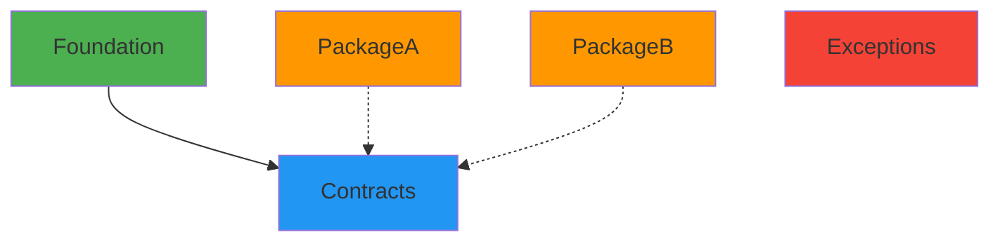

# Package Structure Overview

## 📦 Monorepo Packages

The Pixielity Framework consists of 5 packages managed in a single monorepo:

```
pixielity/framework (monorepo)
├── pixielity/contracts      → src/Contracts/
├── pixielity/exceptions     → src/Exceptions/
├── pixielity/foundation     → src/Foundation/
├── pixielity/package-a      → src/PackageA/
└── pixielity/package-b      → src/PackageB/
```

## 🗂️ Directory Structure

```
src/
├── Contracts/              # Framework interfaces and contracts
│   ├── composer.json       ✅ Full production config
│   ├── README.md           ✅ Package documentation
│   ├── tests/              ✅ Test directory
│   ├── Application.php     # Application contract
│   └── Container.php       # Container contract
│
├── Exceptions/             # Exception classes
│   ├── composer.json       ✅ Full production config
│   ├── README.md           ✅ Package documentation
│   ├── tests/              ✅ Test directory
│   ├── PixielityException.php
│   └── RuntimeException.php
│
├── Foundation/             # Core application implementation
│   ├── composer.json       ✅ Full production config (depends on Contracts)
│   ├── README.md           ✅ Package documentation
│   ├── tests/              ✅ Test directory
│   ├── Application.php     # Application implementation
│   └── Container.php       # Container implementation
│
├── PackageA/               # Example package A
│   ├── composer.json       ✅ Full production config
│   ├── README.md           ✅ Package documentation
│   ├── LICENSE             ✅ MIT License
│   ├── src/
│   │   └── Service.php
│   └── tests/
│       ├── Unit/
│       ├── Integration/
│       └── ServiceTest.php
│
└── PackageB/               # Example package B
    ├── composer.json       ✅ Full production config
    ├── README.md           ✅ Package documentation
    ├── LICENSE             ✅ MIT License
    ├── src/
    └── tests/
        ├── Unit/
        └── Integration/
```

## 🔗 Package Dependencies



### Dependency Graph

- **Foundation** → depends on **Contracts**
- **PackageA** → can use **Contracts** (optional)
- **PackageB** → can use **Contracts** (optional)
- **Exceptions** → standalone

## 📋 Package Details

### 1. pixielity/contracts
**Purpose**: Framework interfaces and abstractions  
**Type**: Library  
**Dependencies**: PSR-11 (Container)  
**Used By**: Foundation, other packages

**Key Files**:
- `Application.php` - Application contract
- `Container.php` - Container contract

### 2. pixielity/exceptions
**Purpose**: Exception classes  
**Type**: Library  
**Dependencies**: None  
**Used By**: All packages

**Key Files**:
- `PixielityException.php` - Base exception
- `RuntimeException.php` - Runtime exception

### 3. pixielity/foundation
**Purpose**: Core application and container  
**Type**: Library  
**Dependencies**: Contracts, PSR-11  
**Used By**: Applications

**Key Files**:
- `Application.php` - Application implementation
- `Container.php` - Container implementation

### 4. pixielity/package-a
**Purpose**: Example service package  
**Type**: Library  
**Dependencies**: None  
**Used By**: Applications

**Key Files**:
- `Service.php` - Example service

### 5. pixielity/package-b
**Purpose**: Example extended functionality  
**Type**: Library  
**Dependencies**: None  
**Used By**: Applications

## 🔧 Configuration

### Root composer.json

```json
{
    "repositories": [
        {
            "type": "path",
            "url": "./src/*",
            "options": {"symlink": true}
        }
    ],
    "replace": {
        "pixielity/contracts": "self.version",
        "pixielity/exceptions": "self.version",
        "pixielity/foundation": "self.version",
        "pixielity/package-a": "self.version",
        "pixielity/package-b": "self.version"
    }
}
```

**Benefits**:
- ✅ Wildcard pattern automatically includes all packages
- ✅ All packages use monorepo versioning
- ✅ Symlinked for development
- ✅ No need to update when adding packages

### PHPStan Configuration

```yaml
parameters:
    paths:
        - src        # Analyzes all packages
        - playground
```

**Benefits**:
- ✅ Simple configuration
- ✅ Automatically includes all packages
- ✅ No need to update when adding packages

## 📦 Installation

### Install Entire Framework
```bash
composer require pixielity/framework
```

### Install Individual Packages
```bash
# Core packages
composer require pixielity/contracts
composer require pixielity/exceptions
composer require pixielity/foundation

# Feature packages
composer require pixielity/package-a
composer require pixielity/package-b
```

## 🧪 Testing

### Test All Packages
```bash
make test
# or
composer test
```

### Test Specific Package
```bash
make test-package-a
make test-package-b
# or
vendor/bin/phpunit --testsuite=PackageA
vendor/bin/phpunit --testsuite=PackageB
```

## 📊 Package Statistics

| Package | Files | Lines | Tests | Coverage |
|---------|-------|-------|-------|----------|
| Contracts | 2 | ~50 | TBD | TBD |
| Exceptions | 2 | ~30 | TBD | TBD |
| Foundation | 2 | ~200 | TBD | TBD |
| PackageA | 1 | ~50 | 1 | TBD |
| PackageB | 0 | ~0 | 0 | TBD |

## 🚀 Usage Examples

### Using Contracts
```php
<?php

use Pixielity\Contracts\Application;
use Pixielity\Contracts\Container;

class MyApp implements Application {
    // Implementation
}
```

### Using Foundation
```php
<?php

use Pixielity\Foundation\Application;

$app = new Application();
$app->boot();
```

### Using Exceptions
```php
<?php

use Pixielity\Exceptions\RuntimeException;

throw new RuntimeException('Error message');
```

### Using PackageA
```php
<?php

use Pixielity\PackageA\Service;

$service = new Service();
$result = $service->execute();
```

## 🔄 Monorepo Workflow

### Adding a New Package

1. **Create directory structure**:
   ```bash
   mkdir -p src/PackageC/{src,tests}
   ```

2. **Create composer.json**:
   ```json
   {
       "name": "pixielity/package-c",
       "autoload": {
           "psr-4": {"Pixielity\\PackageC\\": "src/"}
       }
   }
   ```

3. **Add to root replace**:
   ```json
   "replace": {
       "pixielity/package-c": "self.version"
   }
   ```

4. **Install**:
   ```bash
   composer install
   ```

**Note**: Repository wildcard (`./src/*`) automatically includes new packages!

## 📝 Best Practices

### Package Design
- ✅ Keep packages focused and single-purpose
- ✅ Use contracts for abstractions
- ✅ Minimize dependencies between packages
- ✅ Write tests for all packages

### Versioning
- ✅ All packages use `self.version`
- ✅ Synchronized versioning across monorepo
- ✅ Tag releases at root level

### Testing
- ✅ Each package has its own tests
- ✅ Tests run together in CI
- ✅ Coverage tracked per package

## 🎯 Summary

✅ **5 packages** in monorepo  
✅ **All packages** have composer.json  
✅ **All packages** have README.md  
✅ **All packages** have test directories  
✅ **Wildcard repository** pattern  
✅ **Simplified PHPStan** paths  
✅ **Complete replace** directive  
✅ **Production ready** configuration  

---

**Total Packages**: 5  
**Core Packages**: 3 (Contracts, Exceptions, Foundation)  
**Feature Packages**: 2 (PackageA, PackageB)  
**Status**: ✅ Production Ready
