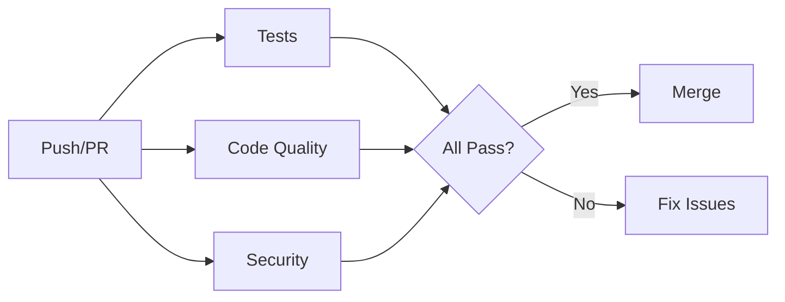
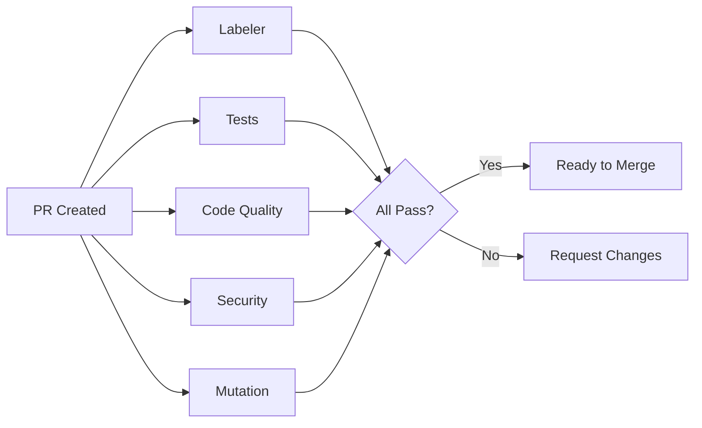
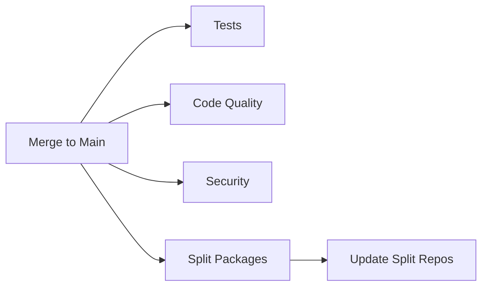
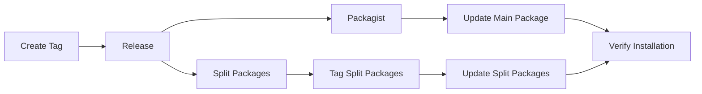
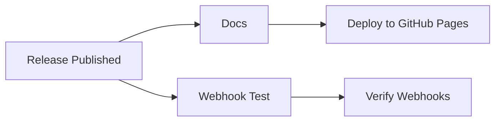

# Workflows Overview

Complete guide to all GitHub Actions workflows in the Pixielity Framework.

## 📊 Workflow Summary

| Workflow | Trigger | Purpose | Duration |
|----------|---------|---------|----------|
| 🧪 Tests | push, PR | Run test suite | ~3 min |
| 🔍 Code Quality | push, PR | Static analysis, formatting | ~2 min |
| 🔒 Security | push, PR, schedule | Security audit | ~1 min |
| 🧬 Mutation | PR | Mutation testing | ~10 min |
| 🚀 Release | tag | Create GitHub release | ~1 min |
| 📦 Packagist | tag, release | Update Packagist | ~2 min |
| 🔀 Split Packages | push, tag | Split monorepo | ~5 min |
| 🔗 Webhook Test | manual, composer.json | Test webhooks | ~1 min |
| 📚 Docs | push (main) | Deploy documentation | ~1 min |
| 🏷️ Labeler | PR | Auto-label PRs | ~30 sec |

## 🔄 Workflow Stages

### Stage 1: Development (Push/PR)



**Workflows**:
1. **Tests** (`tests.yml`)
   - PHP 8.3, 8.4
   - Unit, Integration, Feature tests
   - Coverage reporting

2. **Code Quality** (`code-quality.yml`)
   - PHPStan Level 8
   - Laravel Pint
   - Rector

3. **Security** (`security.yml`)
   - Composer audit
   - Dependency review

### Stage 2: Pull Request



**Additional Workflows**:
4. **Labeler** (`labeler.yml`)
   - Auto-label based on files changed
   - Package-specific labels

5. **Mutation** (`mutation.yml`)
   - Infection mutation testing
   - Tests the quality of tests

### Stage 3: Merge to Main



**Workflows**:
6. **Split Packages** (`split-packages.yml`)
   - Split monorepo to separate repos
   - Update split repositories
   - Maintain package independence

### Stage 4: Release



**Workflows**:
7. **Release** (`release.yml`)
   - Create GitHub release
   - Generate changelog
   - Attach assets

8. **Packagist** (`packagist.yml`)
   - Update main package
   - Verify installation
   - Notify success

9. **Split Packages** (`split-packages.yml`)
   - Tag split packages
   - Update Packagist for each package

### Stage 5: Post-Release



**Workflows**:
10. **Docs** (`docs.yml`)
    - Deploy documentation
    - Update GitHub Pages

11. **Webhook Test** (`webhook-test.yml`)
    - Test Packagist webhooks
    - Verify composer.json files

## 📋 Detailed Workflow Descriptions

### 1. Tests Workflow (`tests.yml`)

**Purpose**: Run comprehensive test suite

**Triggers**:
- Push to main/develop
- Pull requests

**Matrix**:
- PHP: 8.3, 8.4
- OS: ubuntu-latest

**Steps**:
1. Checkout code
2. Setup PHP with extensions
3. Cache Composer dependencies
4. Validate composer.json
5. Install dependencies
6. Run tests
7. Generate coverage (PHP 8.3 only)
8. Upload to Codecov

**Secrets Required**:
- `CODECOV_TOKEN` (optional)

### 2. Code Quality Workflow (`code-quality.yml`)

**Purpose**: Ensure code quality standards

**Triggers**:
- Push to main/develop
- Pull requests

**Jobs**:

**PHPStan**:
- Level 8 static analysis
- Larastan integration
- Type checking

**Pint**:
- Laravel code formatting
- PSR-12 compliance
- Import optimization

**Rector**:
- Automated refactoring
- PHP 8.4 features
- Code modernization

### 3. Security Workflow (`security.yml`)

**Purpose**: Security scanning and auditing

**Triggers**:
- Push to main/develop
- Pull requests
- Weekly schedule (Sunday midnight)

**Jobs**:

**Security Audit**:
- Composer audit
- Vulnerability detection
- Dependency scanning

**Dependency Review** (PR only):
- Review dependency changes
- Fail on moderate+ severity

### 4. Mutation Workflow (`mutation.yml`)

**Purpose**: Test the quality of tests

**Triggers**:
- Pull requests
- Manual dispatch

**Steps**:
1. Setup PHP with Xdebug
2. Install dependencies
3. Run Infection
4. Upload mutation report

**Note**: Continues on error (informational)

### 5. Release Workflow (`release.yml`)

**Purpose**: Automated release creation

**Triggers**:
- Version tags (v*.*.*)

**Steps**:
1. Checkout with full history
2. Generate changelog
3. Create GitHub release
4. Detect prerelease (alpha, beta, rc)

**Permissions**:
- `contents: write`

### 6. Packagist Workflow (`packagist.yml`)

**Purpose**: Update package on Packagist

**Triggers**:
- Version tags
- Release published
- Manual dispatch

**Jobs**:

**Update Packagist**:
- Trigger Packagist update API
- Notify of new release

**Verify Package**:
- Test installation
- Validate composer.json

**Notify Success**:
- Success notification

**Secrets Required**:
- `PACKAGIST_USERNAME`
- `PACKAGIST_TOKEN`

### 7. Split Packages Workflow (`split-packages.yml`)

**Purpose**: Split monorepo to separate repositories

**Triggers**:
- Push to main
- Version tags
- Manual dispatch

**Matrix**:
- contracts
- exceptions
- foundation
- package-a
- package-b

**Steps**:
1. Checkout with full history
2. Setup SSH key
3. Split package to separate repo
4. Tag package (if version tag)
5. Update Packagist

**Secrets Required**:
- `SPLIT_SSH_KEY`
- `PACKAGIST_USERNAME`
- `PACKAGIST_TOKEN`

### 8. Webhook Test Workflow (`webhook-test.yml`)

**Purpose**: Test webhook connectivity

**Triggers**:
- Manual dispatch
- Changes to composer.json

**Jobs**:

**Test Webhook**:
- Test main package webhook
- Test split package webhooks
- Verify HTTP responses

**Verify Composer**:
- Validate all composer.json
- Check package names
- Ensure consistency

### 9. Docs Workflow (`docs.yml`)

**Purpose**: Deploy documentation

**Triggers**:
- Push to main (docs/** or **.md)
- Manual dispatch

**Steps**:
1. Checkout code
2. Deploy to GitHub Pages
3. Custom domain support

### 10. Labeler Workflow (`labeler.yml`)

**Purpose**: Auto-label pull requests

**Triggers**:
- PR opened, synchronized, reopened

**Labels**:
- Package-specific (package: contracts, etc.)
- File type (documentation, tests, ci/cd)
- Configuration changes

**Permissions**:
- `contents: read`
- `pull-requests: write`

## 🔐 Required Secrets

### Packagist Publishing

```bash
gh secret set PACKAGIST_USERNAME --body "your-username"
gh secret set PACKAGIST_TOKEN --body "your-api-token"
```

### Package Splitting

```bash
# Generate SSH key
ssh-keygen -t ed25519 -C "bot@pixielity.com" -f ~/.ssh/pixielity_split

# Add to GitHub
gh secret set SPLIT_SSH_KEY < ~/.ssh/pixielity_split

# Add public key to each split repo as deploy key
cat ~/.ssh/pixielity_split.pub
```

### Coverage Reporting (Optional)

```bash
gh secret set CODECOV_TOKEN --body "your-codecov-token"
```

## 🎯 Workflow Best Practices

### Caching

All workflows use Composer caching:
```yaml
- name: Cache Composer dependencies
  uses: actions/cache@v4
  with:
    path: ${{ steps.composer-cache.outputs.dir }}
    key: ${{ runner.os }}-composer-${{ hashFiles('**/composer.lock') }}
```

### Parallel Execution

Workflows run in parallel when possible:
- Tests + Code Quality + Security (on push/PR)
- Multiple PHP versions (matrix)
- Multiple packages (split workflow)

### Fail Fast

Most workflows use `fail-fast: false` to see all failures:
```yaml
strategy:
  fail-fast: false
  matrix:
    php: ['8.3', '8.4']
```

### Conditional Execution

Workflows use conditions to optimize:
```yaml
if: github.event_name == 'pull_request'
if: startsWith(github.ref, 'refs/tags/')
if: matrix.coverage
```

## 📊 Monitoring

### View Workflow Runs

```bash
# List all runs
gh run list

# List specific workflow
gh run list --workflow=tests.yml

# Watch current run
gh run watch

# View logs
gh run view --log
```

### Workflow Status Badges

Add to README.md:
```markdown
[](https://github.com/pixielity/framework/actions)
[](https://github.com/pixielity/framework/actions)
```

## 🔄 Workflow Dependencies

```
Release Tag (v1.0.0)
├── Release Workflow
│   └── Create GitHub Release
├── Packagist Workflow
│   ├── Update Main Package
│   └── Verify Installation
└── Split Packages Workflow
    ├── Split to Separate Repos
    ├── Tag Split Packages
    └── Update Split Packages on Packagist
```

## ✅ Summary

- **10 workflows** covering all aspects
- **Automated testing** on multiple PHP versions
- **Code quality** enforcement
- **Security scanning** with scheduled checks
- **Automated releases** with changelog
- **Package splitting** for monorepo
- **Packagist integration** for publishing
- **Documentation deployment** to GitHub Pages

All workflows are production-ready and optimized for performance!
